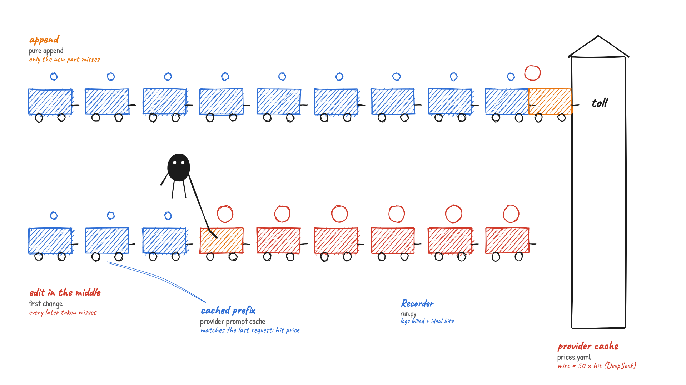
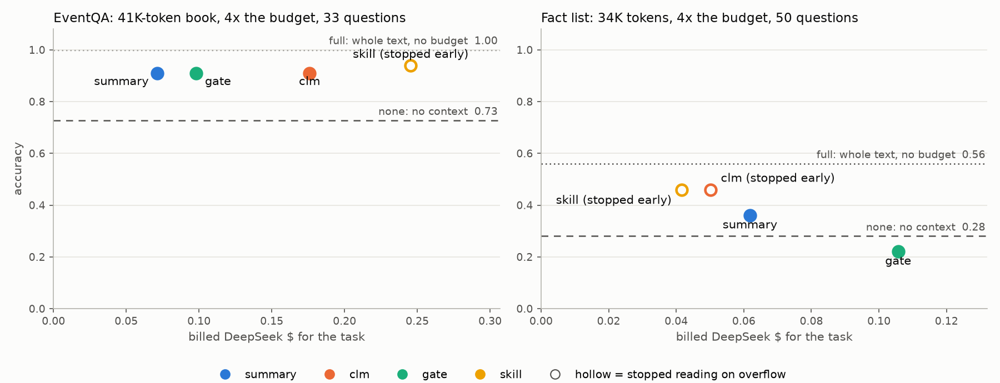
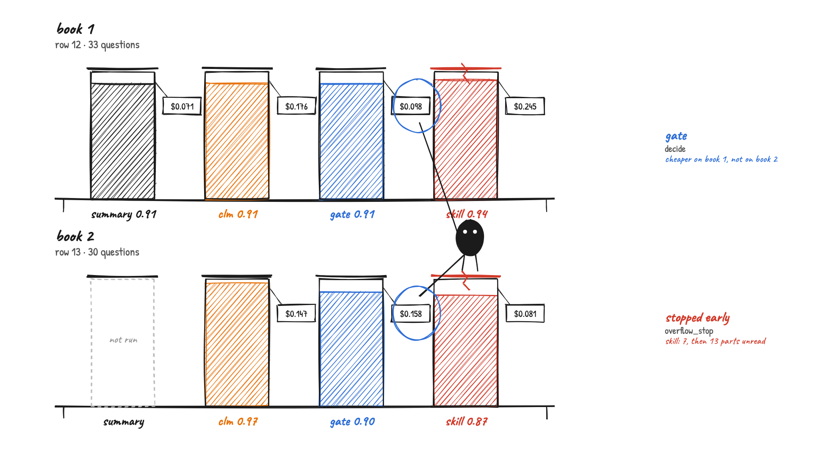
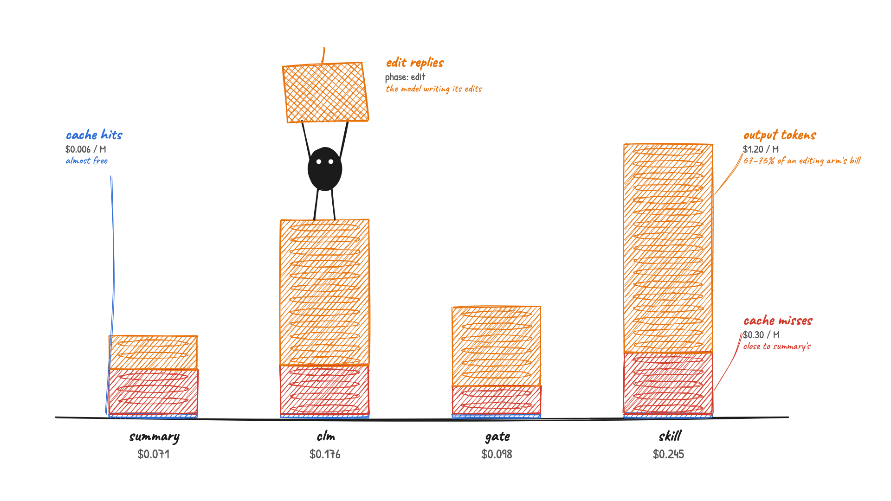

# Context editing under prompt-cache billing

Does an AI model that edits its own context still save money on a hosted API that bills through a prompt cache?

This repo tests **Context Language Models (CLMs)** from [Shao et al., Sep 2026](https://arxiv.org/abs/2609.37725) in a setting the paper does not study. A CLM keeps its working context as a file that it edits with shell commands. The paper reports higher accuracy than harness-scheduled summaries, and fewer FLOPs, on a self-hosted server that can reuse cached work after an edit. A hosted API cannot do that, so this repo measures the trade-off in **billed dollars** on DeepSeek Flash. It also tests a **cache-aware gate** that refuses edits whose rebilled cache costs more than they save. The code package and CLI are called `cacheclm`.

**Headline (pilot).** On MemoryAgentBench texts about 4× the context budget, with DeepSeek Flash:
- **Book (EventQA):** letting the model edit its context matched the summary baseline's accuracy (0.91) but billed **2.5×** as much. The cache-aware gate kept the same accuracy at **1.4×**. On a second book, though, the gate was no cheaper than plain editing.
- **Where the money goes:** about **70–76%** of an editing arm's bill is the model *writing* its edits (output tokens). Its cache-miss cost is close to the summary arm's. So editing costs more mainly because of what the model writes, not because edits break the cache.
- **Fact list (FactConsolidation):** the editing arms would not delete facts to make room, so they stopped reading a third of the way in. The summary and gate arms read everything but lost most facts. No arm came close to the whole-text ceiling.
- **Scale:** this is a pilot: one or two samples per task, 30–50 questions each. All DeepSeek runs here, including smoke tests, cost **$3.51**.

## How it works

The pictures below are drawn from the code; each label names the file or function it shows. More pictures and a source table for every label are in [`docs/codebase-visual-atlas/`](docs/codebase-visual-atlas/index.html).

### 1. Why an edit costs money on a hosted API



A hosted prompt cache reuses only the **start** of a request that matches the previous request:
- **Append:** adding text at the end leaves everything before it cached. Only the new part is billed at the full ("miss") price.
- **Edit in the middle:** every token after the first change becomes a cache miss on the next call.
- **The price gap:** DeepSeek bills a miss at **50×** a hit ($0.30 vs $0.006 per million tokens). An edit that deletes a little near the start can therefore cost far more than it saves.

The provider's cache is drawn as it bills. The code does not implement that cache: it only logs the billed hits, alongside the hits a perfect prefix cache would give ("ideal").

### 2. One sample, one arm


Every arm reads the same text, one part at a time, into a box of fixed size (the context budget):
- **Between parts**, the arm's policy shrinks the box: the model edits it, or the harness summarizes it.
- **Overflow, editing arms (CacheCLM's own policy, not the paper's):** an editing arm gets up to 6 tries to make room for the next part. If it still cannot, it stops reading and answers with what it has. The log records where it stopped and how many parts it never read.
- **Overflow, summary arm:** the harness cuts the oldest lines.
- **Questions:** after the last part, the box is frozen and every question is asked against it, under **one question prompt for every arm**.
- **Logging:** every call is logged with its billed and ideal cache hits.

### 3. Four arms, two references


| Arm | Who shrinks the context | What can stop an edit |
|---|---|---|
| **summary** | The harness: at 75% of the budget, older parts become one summary; the latest part(s) stay verbatim | — |
| **clm** | The model, with shell or Python edits | Empty file, or growth past the budget (rolled back) |
| **gate** | The model | The same, plus the cache-aware gate below |
| **skill** (exploratory) | The model, plus a short recipe: books → an event log of each new part; facts → delete overridden facts, then the oldest | Empty file, or growth past the budget |
| none (reference) | No context at all: the world-knowledge floor | — |
| full (reference) | The whole text, no budget: the ceiling | — |

The editing prompt carries the paper's main advice in our own words:
- think first;
- prefer one large edit;
- locate text with code and **never retype text you keep**;
- an edit makes everything after it be re-read.

### 4. The cache-aware gate


An edit passes only if what it saves on later calls outweighs what it costs once:

```text
deleted_tokens × turns_left × hit_price   >=   tokens_after_the_first_change × (miss_price − hit_price)
```

- **Pure append:** costs nothing.
- **Over the limit:** while the next part would not fit, any edit that shrinks the context passes.
- **Example:** DeepSeek prices, a 30K context, 10 turns left.

| Edit | Deleted | Re-billed after it | Cost | Saving | Decision |
|---|---|---|---|---|---|
| A search result in the middle | 6K | 16K | $0.0047 | $0.00036 | reject |
| The newest tool output | 6K | 0.5K | $0.00015 | $0.00036 | allow |

### 5. How one edit runs


The model never touches its context directly:
- **The note:** the model reads a note showing budget use, a nudge when a threshold is crossed, and an over-limit warning on every call while over.
- **The command:** it replies with one command, which runs on `ctx.txt` inside a macOS `sandbox-exec` jail. The jail has no network, an allow-list of programs and a 10-second limit.
- **Checks:** the result is rolled back if it empties the file or grows it past the budget; then the gate decides.
- **Feedback:** the outcome goes into the next note.

## Result 1: harder DeepSeek run (the headline)

**Setup:**
- **Model:** DeepSeek Flash with thinking off.
- **Data:** two MemoryAgentBench samples, each about **4× its context budget**. Neither is in the planned full-run set.
  - **EventQA:** a 41K-token stretch of a novel, in 25 parts, with a 10K budget. The 33 questions are the ones whose events fall inside that stretch. Each asks which of 6 events happens next.
  - **Fact list:** FactConsolidation single-hop, 34K tokens, in 18 parts, with an 8K budget and 50 questions. Newer facts override older ones.
- **Repeats:** one run per arm. Config: `configs/deepseek_hard.yaml`.



**EventQA:**

| Arm | Accuracy | Billed $ | Cost vs summary | Notes |
|---|---|---|---|---|
| none | 0.73 | 0.004 | — | the questions list the earlier events, so guessing is easy |
| **summary** | 0.91 | 0.071 | 1.0× | |
| **clm** | 0.91 | 0.176 | 2.5× | 47 edits that changed the context |
| **gate** | 0.91 | 0.098 | **1.4×** | 22 edits rejected on price |
| skill | 0.94 | 0.245 | 3.4× | stopped reading with 7 of 25 parts unread |
| full | 1.00 | 0.024 | — | |

**Fact list:**

| Arm | Accuracy | Billed $ | Cost vs summary | Notes |
|---|---|---|---|---|
| none | 0.28 | 0.003 | — | |
| **summary** | 0.36 | 0.062 | 1.0× | read everything; answered only 1 of the 9 questions whose fact is in the first 6 parts |
| **clm** | 0.46 | 0.050 | 0.8× | **stopped reading at part 6 of 18** |
| **gate** | 0.22 | 0.106 | 1.7× | read everything; 11 edits rejected on price; 39 answers wrong because the fact was missing |
| skill | 0.46 | 0.042 | 0.7× | **stopped reading at part 6 of 18** |
| full | 0.56 | 0.024 | — | |

How to read these numbers:
- **On the book, editing did not buy accuracy.** clm, gate and summary all scored 0.91. clm billed 2.5× summary, because each mid-context edit turns everything after it into cache misses. The gate refused 22 of those edits and cut the bill to 1.4× at the same accuracy. This is the trade-off it was built for.
- **On the fact list, the 0.46 of clm and skill is not a win.**
  - They never made room for part 7. In all 6 tries they answered READY while over the limit, so they stopped reading with 12 of 18 parts unread.
  - Their score comes from keeping the first 6 parts verbatim, which answers 7 of the 9 questions whose fact is there, plus guessing on the 41 questions about facts they never read (16 right, close to the no-context rate).
  - They look cheap only because they stopped early. They gave identical answers because they kept the same text and every arm answers under the same question prompt.
- **The gate backfired on facts.** It refused 11 edits that would have rebilled the cache. The edits it later had to accept, once over the limit, likely deleted more: 39 answers were wrong because the fact was missing, the most of any arm. It ended at 0.22 for 1.7× the cost.
- **Caveat.** These are single runs of one sample per task, with 33 or 50 questions. One EventQA question is worth 0.03, so the 0.91–0.94 differences are noise. The cost ratios are more stable than the accuracy differences, because every call is billed.

**Cost:** $0.89. Full tables, including every edit attempt's outcome: [`docs/results/ds_hard/summary.md`](docs/results/ds_hard/summary.md).

### A second book, editing arms only

To check whether the book result holds, the three editing arms ran on a second novel. It is EventQA row 13, the same size as before: 41K tokens, about 4× the budget. It has 30 questions. Config: `configs/deepseek_extra.yaml`.



| Arm | Book 1 accuracy | Book 1 $ | Book 2 accuracy | Book 2 $ |
|---|---|---|---|---|
| summary | 0.91 | 0.071 | not run | — |
| clm | 0.91 | 0.176 | **0.97** | 0.147 |
| gate | 0.91 | **0.098** | 0.90 | 0.158 |
| skill | 0.94 (stopped, 7 parts unread) | 0.245 | 0.87 (stopped, 13 parts unread) | 0.081 |

- **The gate's saving did not repeat.** On book 2 it rejected 17 edits, but the model kept writing replacement edits. The gate ended up **more** expensive than clm ($0.158 vs $0.147) and 2 questions less accurate.
- **Skill stopped reading early on both books,** with 13 of 25 parts unread on book 2, so its cheap $0.081 is not comparable.
- **clm was the most accurate on book 2** (0.97). With 30 questions, that is 2 questions ahead of the gate.

### Where the money goes



The bill of each arm, split by DeepSeek's three prices:

| Book | Arm | Total $ | Cache hits | Cache misses | Output | Output share |
|---|---|---|---|---|---|---|
| 1 | summary | 0.071 | 0.001 | 0.040 | 0.030 | 42% |
| 1 | clm | 0.176 | 0.001 | 0.044 | 0.130 | 74% |
| 1 | gate | 0.098 | 0.002 | 0.025 | 0.071 | 73% |
| 1 | skill | 0.245 | 0.003 | 0.055 | 0.187 | 76% |
| 2 | clm | 0.147 | 0.001 | 0.042 | 0.103 | 70% |
| 2 | gate | 0.158 | 0.002 | 0.040 | 0.116 | 73% |
| 2 | skill | 0.081 | 0.002 | 0.025 | 0.054 | 67% |

- **Cache misses are not the main cost.** clm's misses ($0.044) were about the same as the summary arm's ($0.040), because the summary arm also rewrites the front of its context each time it compacts.
- **Output is the main cost.** It is the THOUGHT, the code and any notes the model writes on every edit call, billed at $1.20 per million tokens, 4× the miss price.
- **This limits the gate.** It weighs only the cache-miss cost of an edit. The output cost is already spent by the time it decides, and a rejected edit usually leads to another edit reply.

Tables: [`docs/results/ds_extra/summary.md`](docs/results/ds_extra/summary.md). **Cost:** $0.38.

## Result 2: smaller DeepSeek run (EventQA saturated)

**Setup:** the same arms on smaller texts, about 1.6× the budget: a 16K-token book stretch with 15 questions, and the 6.5K-token fact list with a 4K budget, asked as single-hop and as multi-hop questions. Config: `configs/deepseek_small.yaml`.

| Arm | Facts, single-hop | Facts, multi-hop | EventQA | Billed cost vs summary |
|---|---|---|---|---|
| none | 0.20 | 0.04 | 0.73 | — |
| summary | 0.50 | 0.24 | 1.00 | 1.0× |
| clm | 0.48 | 0.16 | 1.00 | 1.4× |
| gate | 0.54 | 0.08 | 1.00 | 1.2× |
| skill | **0.64** | **0.28** | 1.00 | 3.1× |
| full | 0.54 | 0.04 | 1.00 | — |

- **EventQA was too easy:** every arm scored 1.00, which is why Result 1 uses a longer text.
- **Facts:** the skill arm's "delete overridden facts" recipe beat even the whole text (0.64 vs 0.54). With every fact in view, DeepSeek resolves some conflicts wrongly.
- **Multi-hop facts:** every arm is near the floor.

**Cost:** $0.30. Tables: [`docs/results/ds_small/summary.md`](docs/results/ds_small/summary.md).

## Appendix: free local check with Qwen3.5 9B

Before spending, the same three small tasks ran on a laptop: Qwen3.5 9B on Ollama, an M3 Pro with 18 GB of RAM, `configs/local.yaml`. It is a weak context editor, so these numbers check the harness and are not results:
- **Destructive edits:** its Python edits deleted most facts. It ended with 1,000–1,700 of 4,000 tokens used, and its fact accuracy fell from summary's 0.50 to 0.12–0.36.
- **Runaway replies:** 2–3 replies per arm ran to the 10,000-token cap, in repetition loops or by copying the book word for word.
- **Weak ceiling:** even with the whole text it scored only 0.46 on single-hop facts.

The run found five harness bugs, all fixed since and covered by tests (see below). Tables: [`docs/results/local/summary.md`](docs/results/local/summary.md).

## What we learned

### About context editing under cache billing

- **Rewriting the whole context is the expensive habit.** In an early DeepSeek smoke run, 11 of 17 applied edits rewrote the whole context, and about 30% of edit replies ran into the reply cap. The paper's own prompt says to locate text with code and never retype it. With that rule added, clm billed 1.0–1.9× summary in the small run and 2.5× in the harder one. We have no clean before-and-after comparison on DeepSeek.
- **The bill is mostly what the model writes.** About 70–76% of an editing arm's cost is output tokens. Its cache misses cost about the same as the summary arm's. To make context editing cheaper on a hosted API, cut the model's edit replies (fewer, shorter edits); avoiding cache misses matters less.
- **A price-aware gate helps only sometimes.** It halved clm's extra cost on the first book, but cost more than clm on the second. It weighs only cache misses, and a rejected edit is often followed by another reply. On a fact list under pressure, refusing early edits only moved the deletion later and made it worse.
- **Under heavy pressure, the model may stop instead of deleting.** DeepSeek preferred to answer READY while over the limit rather than drop facts. A harness that silently cuts the oldest lines would hide this. We first did that, and Qwen's scores looked good until we found the cut was doing the work, because "keep the newest" suits a fact list where newer facts win.
- **Summaries of lists become inventories.** The summary arm hit its length cap on most fact summaries, even after the prompt stated the cap. Cut-off summaries lose their newest lines, which are the ones that matter for fact lists.

### About the harness (bugs found by running it, all fixed)

| Problem | Symptom | Fix |
|---|---|---|
| Text-block parsing | The closing fence of a text block was read as an empty command | Fenced blocks are parsed one at a time |
| "Nothing to do" wrappers | Qwen wrapped READY as `echo "READY"`; DeepSeek used `true`; each one used up an edit slot | Both count as READY |
| Python blocks ignored | A 7,971-token reply in a ```` ```python ```` block was read as READY and thrown away | Python blocks run as `python3 edit.py` |
| Results written to `new.txt` | `ctx.txt` was unchanged; the reply cache then replayed the same failed command up to 6 times | The note now says "ctx.txt did not change" and shows the edits left, so no two prompts repeat |
| Arm-specific question prompts | The skill's recipe and the editing protocol reached the answers (found in review) | One question prompt for every arm |
| Silent forced truncation | It hid edit failures and favoured fact lists | Stop-on-overflow for the editing arms; the cut is kept for the summary arm only |
| Nudges did not fire again | After a compaction, a threshold crossed again stayed silent | The nudge is measured from the size after the previous phase's edits |
| Stream identity by cost | Two samples were treated as one stream whenever their costs matched | A stream fingerprint in each run log |

## Differences from the paper

This is an extension, not a replication. The paper's harness code ([`facebookresearch/context-language-models`](https://github.com/facebookresearch/context-language-models)) was read and compared arm by arm before the DeepSeek runs. The main differences:
- **Benchmark:** the paper's gains come from agentic tasks, where CLM deletes stale tool output. Our memory streams are mostly signal, so smaller gains are expected.
- **Our addition:** the paper measures prefix-reuse FLOPs and reports some API costs. It does not decide or evaluate edits by a provider's billed hit, miss and output prices. The gate and the cache-billing comparison are ours.
- **Overflow:** stop-on-overflow is our own policy, though it echoes the paper's rule for its terminal benchmarks ("a request that would exceed [the budget] ends the run").
- **Simplifications:**
  - our editing turns are not kept in the context;
  - we parse fenced blocks instead of using native tool calls;
  - we count tokens as characters ÷ 4.
- **Baseline:** our summary keeps the latest part(s) verbatim, which likely makes it a stronger baseline than the paper's.

## Data

- **Source:** [MemoryAgentBench](https://huggingface.co/datasets/ai-hyz/MemoryAgentBench) (MIT), pinned to commit `7ea0669`. `scripts/get_data.py` downloads its two parquet files over plain HTTPS and checks their SHA-256.
- **Prompts and scoring** are adapted from the benchmark's `utils/templates.py` and `substring_exact_match`.
- **The runs above** use rows that the planned full run does not evaluate.
- **The planned full run** (`configs/base.yaml`) uses the five ~70K-token EventQA books and the 64K FactConsolidation sets, with a 32K budget. It is estimated at $6–8 and has not been run.

## Run

Needs macOS (edits run under `sandbox-exec`), Python 3.13 and [uv](https://docs.astral.sh/uv/).

```bash
uv sync
uv run python scripts/get_data.py
uv run pytest                                              # 106 tests
uv run cacheclm smoke --config configs/deepseek_hard.yaml  # Result 1, about $0.9
uv run cacheclm report --smoke --config configs/deepseek_hard.yaml
uv run cacheclm smoke --config configs/deepseek_extra.yaml # second book, editing arms only, about $0.4
uv run cacheclm smoke --config configs/deepseek_small.yaml # Result 2, about $0.3
uv run cacheclm smoke --config configs/local.yaml          # free, on Ollama with qwen3.5-9b-32k
uv run cacheclm run                                        # the planned full run (not yet run)
```

- **API key:** `DEEPSEEK_API_KEY` goes in `.env`. Local runs need no key.
- **Spend cap:** every real API call counts against a cap stored in `cache/spend.json`.
- **Free replays and resuming:** cached calls replay for free, and an interrupted run skips the (sample, arm, repeat) runs that already finished.
- **Reports:** each run writes `summary.md`, `summary.html` and a chart to its results folder. The results above are copied to `docs/results/`.

## Credits

- **Method and context-file format:** Context Language Models (arXiv 2609.37725, CC BY 4.0). Its repository (`facebookresearch/context-language-models`) is CC BY-NC 4.0. No code or prompt text is copied; some prompt ideas (locate text with code, do not wipe whole regions, the fit rule for growing edits) are paraphrased from it with this attribution.
- **Data and scoring:** MemoryAgentBench (arXiv 2507.05257), MIT.
- **Illustrations:** hand-drawn SVG (rough.js) rendered with headless Chrome; sources in `docs/codebase-visual-atlas/src/`.
- **Code:** MIT.
