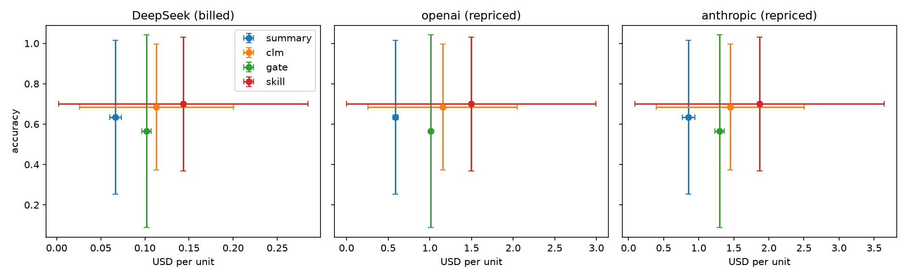

# CacheCLM results

2 units (one per distinct text), means over repeats. Unpaired runs (left out): none.
Diverged streams (costs summed): none.

## All units

Units: 2.

1. **Accuracy, CLM − summary:** +0.050 (95% CI +0.000 to +0.100; sign-flip p = 1.000)
2. **Billed $ on DeepSeek, clm / summary:** 1.42x (95% CI 0.81x to 2.47x; sign-flip p = 1.000)
3. **Billed $ on DeepSeek, gate / summary:** 1.53x (95% CI 1.38x to 1.71x; sign-flip p = 0.497)
4. **Share of CLM's accuracy gain the gate keeps:** -140% (95% CI -140% to -140%)
5. **Billed $ on DeepSeek, skill / summary (exploratory):** 1.52x (95% CI 0.67x to 3.44x; sign-flip p = 1.000)
6. **Accuracy, skill − summary (exploratory):** +0.065 (95% CI +0.030 to +0.100; sign-flip p = 0.497)

| Arm | Accuracy | Billed $ | Edits | Rejected | Re-billed tokens | Forced truncations | Cut off | Cache hit (billed / ideal) |
|---|---|---|---|---|---|---|---|---|
| summary | 0.635 | 0.0665 | 0.0 | 0.0 | 0 | 0.0 | 14.0 | 65% / 67% |
| clm | 0.685 | 0.1131 | 28.0 | 0.5 | 56,349 | 0.0 | 0.5 | 73% / 74% |
| gate | 0.565 | 0.1019 | 35.5 | 16.5 | 47,787 | 0.0 | 0.5 | 71% / 74% |
| skill | 0.700 | 0.1435 | 21.5 | 0.5 | 79,982 | 0.0 | 1.5 | 79% / 80% |
| none | 0.504 | 0.0034 | 0.0 | 0.0 | 0 | 0.0 | 0.0 | 0% / 31% |
| full | 0.780 | 0.0237 | 0.0 | 0.0 | 0 | 0.0 | 0.0 | 97% / 97% |

## eventqa

Units: 1.

1. **Accuracy, CLM − summary:** +0.000 (95% CI +0.000 to +0.000; sign-flip p = 1.000)
2. **Billed $ on DeepSeek, clm / summary:** 2.47x (95% CI 2.47x to 2.47x; sign-flip p = 1.000)
3. **Billed $ on DeepSeek, gate / summary:** 1.38x (95% CI 1.38x to 1.38x; sign-flip p = 1.000)
4. **Share of CLM's accuracy gain the gate keeps:** undefined (CLM gained under 1 point over summary)
5. **Billed $ on DeepSeek, skill / summary (exploratory):** 3.44x (95% CI 3.44x to 3.44x; sign-flip p = 1.000)
6. **Accuracy, skill − summary (exploratory):** +0.030 (95% CI +0.030 to +0.030; sign-flip p = 1.000)

| Arm | Accuracy | Billed $ | Edits | Rejected | Re-billed tokens | Forced truncations | Cut off | Cache hit (billed / ideal) |
|---|---|---|---|---|---|---|---|---|
| summary | 0.909 | 0.0713 | 0.0 | 0.0 | 0 | 0.0 | 14.0 | 61% / 62% |
| clm | 0.909 | 0.1759 | 47.0 | 1.0 | 80,331 | 0.0 | 0.0 | 58% / 61% |
| gate | 0.909 | 0.0981 | 43.0 | 22.0 | 14,139 | 0.0 | 0.0 | 78% / 81% |
| skill | 0.939 | 0.2454 | 37.0 | 1.0 | 132,737 | 0.0 | 2.0 | 74% / 75% |
| none | 0.727 | 0.0041 | 0.0 | 0.0 | 0 | 0.0 | 0.0 | 0% / 19% |
| full | 1.000 | 0.0237 | 0.0 | 0.0 | 0 | 0.0 | 0.0 | 96% / 96% |

## factconsolidation

Units: 1.

1. **Accuracy, CLM − summary:** +0.100 (95% CI +0.100 to +0.100; sign-flip p = 1.000)
2. **Billed $ on DeepSeek, clm / summary:** 0.81x (95% CI 0.81x to 0.81x; sign-flip p = 1.000)
3. **Billed $ on DeepSeek, gate / summary:** 1.71x (95% CI 1.71x to 1.71x; sign-flip p = 1.000)
4. **Share of CLM's accuracy gain the gate keeps:** -140% (95% CI -140% to -140%)
5. **Billed $ on DeepSeek, skill / summary (exploratory):** 0.67x (95% CI 0.67x to 0.67x; sign-flip p = 1.000)
6. **Accuracy, skill − summary (exploratory):** +0.100 (95% CI +0.100 to +0.100; sign-flip p = 1.000)

| Arm | Accuracy | Billed $ | Edits | Rejected | Re-billed tokens | Forced truncations | Cut off | Cache hit (billed / ideal) |
|---|---|---|---|---|---|---|---|---|
| summary | 0.360 | 0.0618 | 0.0 | 0.0 | 0 | 0.0 | 14.0 | 69% / 71% |
| clm | 0.460 | 0.0502 | 9.0 | 0.0 | 32,367 | 0.0 | 1.0 | 85% / 86% |
| gate | 0.220 | 0.1057 | 28.0 | 11.0 | 81,435 | 0.0 | 1.0 | 66% / 68% |
| skill | 0.460 | 0.0416 | 6.0 | 0.0 | 27,228 | 0.0 | 1.0 | 87% / 88% |
| none | 0.280 | 0.0027 | 0.0 | 0.0 | 0 | 0.0 | 0.0 | 0% / 47% |
| full | 0.560 | 0.0237 | 0.0 | 0.0 | 0 | 0.0 | 0.0 | 97% / 98% |

## Repriced under three providers (ideal cache, USD per unit)

| Arm | deepseek | openai | anthropic |
|---|---|---|---|
| summary | 0.0646 | 0.5887 | 0.8563 |
| clm | 0.1109 | 1.1537 | 1.4506 |
| gate | 0.0988 | 1.0123 | 1.2979 |
| skill | 0.1412 | 1.4985 | 1.8654 |

## Edit attempts (means per unit)

Every edit-phase reply: READY, cut off, or a command with one outcome. Overflow stops are the CacheCLM stop-on-overflow policy for edit arms (not the paper's behaviour): the arm read no further parts.

| Arm | Ready | Cut off | Refused | No change | Emptied | Rejected (growth) | Rejected (price) | Applied | Overflow stops | Unread parts |
|---|---|---|---|---|---|---|---|---|---|---|
| clm | 7.5 | 0.5 | 1 | 6 | 0 | 0.5 | 0 | 27.5 | 0.5 | 6 |
| gate | 16 | 0.5 | 0.5 | 5 | 0 | 0 | 16.5 | 19 | 0 | 0 |
| skill | 7.5 | 1.5 | 0 | 4 | 0 | 0.5 | 0 | 21 | 1 | 9.5 |

## Fact errors: retention (gold fact lost) vs resolution (gold fact kept, wrong answer)

| Arm | Retention | Resolution |
|---|---|---|
| summary | 32 | 0 |
| clm | 26 | 1 |
| gate | 39 | 0 |
| skill | 26 | 1 |

## Per unit

| Unit | Family | Samples | summary acc | summary $ | clm acc | clm $ | gate acc | gate $ | skill acc | skill $ |
|---|---|---|---|---|---|---|---|---|---|---|
| 16d6cfdc97 | eventqa | Accurate_Retrieval/12[285000:450000]q45-97x33 | 0.91 | 0.0713 | 0.91 | 0.1759 | 0.91 | 0.0981 | 0.94 | 0.2454 |
| 8a1dff8d00 | factconsolidation | Conflict_Resolution/5 | 0.36 | 0.0618 | 0.46 | 0.0502 | 0.22 | 0.1057 | 0.46 | 0.0416 |

## Gate decisions (examples)

- `cat new.txt >> ctx.txt`: allowed: frees 0 tokens for 56 turns, breaks 0 cached tokens
- `python3 -c "
s=open('ctx.txt').read()
new=open('new.txt').read()
i=s.index('[[CTX_TURN 1 role=chunk]]')
j=s.index('[[CTX_TURN 99 role=notes]]')
s=s[:i]+new+'\n'`: allowed: frees 2,806 tokens for 55 turns, breaks 2,284 cached tokens
- `python3 edit.py`: edit rejected: breaks 2,373 cached tokens to save 0; prefer deleting near the end
- `python3 edit.py`: edit rejected: breaks 4,049 cached tokens to save 325; prefer deleting near the end

