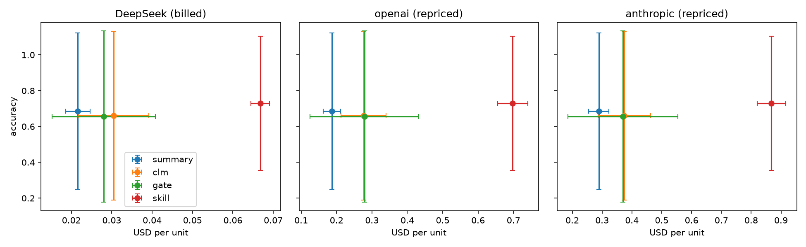

# CacheCLM results

2 units (one per distinct text), means over repeats. Unpaired runs (left out): none.
Diverged streams (costs summed): none.

## All units

Units: 2.

1. **Accuracy, CLM − summary:** -0.025 (95% CI -0.050 to +0.000; sign-flip p = 1.000)
2. **Billed $ on DeepSeek, clm / summary:** 1.39x (95% CI 1.02x to 1.89x; sign-flip p = 0.497)
3. **Billed $ on DeepSeek, gate / summary:** 1.23x (95% CI 0.79x to 1.92x; sign-flip p = 1.000)
4. **Share of CLM's accuracy gain the gate keeps:** undefined (CLM gained under 1 point over summary)
5. **Billed $ on DeepSeek, skill / summary (exploratory):** 3.11x (95% CI 2.74x to 3.52x; sign-flip p = 0.497)
6. **Accuracy, skill − summary (exploratory):** +0.045 (95% CI +0.000 to +0.090; sign-flip p = 1.000)

| Arm | Accuracy | Billed $ | Edits | Rejected | Re-billed tokens | Forced truncations | Cut off | Cache hit (billed / ideal) |
|---|---|---|---|---|---|---|---|---|
| summary | 0.685 | 0.0216 | 0.0 | 0.0 | 0 | 0.0 | 4.0 | 80% / 83% |
| clm | 0.660 | 0.0305 | 9.5 | 0.5 | 11,516 | 0.0 | 0.0 | 73% / 79% |
| gate | 0.655 | 0.0280 | 6.0 | 2.0 | 3,912 | 0.0 | 0.5 | 85% / 88% |
| skill | 0.730 | 0.0668 | 14.0 | 0.0 | 28,578 | 0.0 | 0.5 | 80% / 82% |
| none | 0.427 | 0.0038 | 0.0 | 0.0 | 0 | 0.0 | 0.0 | 0% / 39% |
| full | 0.645 | 0.0106 | 0.0 | 0.0 | 0 | 0.0 | 0.0 | 94% / 95% |

## eventqa

Units: 1.

1. **Accuracy, CLM − summary:** +0.000 (95% CI +0.000 to +0.000; sign-flip p = 1.000)
2. **Billed $ on DeepSeek, clm / summary:** 1.02x (95% CI 1.02x to 1.02x; sign-flip p = 1.000)
3. **Billed $ on DeepSeek, gate / summary:** 0.79x (95% CI 0.79x to 0.79x; sign-flip p = 1.000)
4. **Share of CLM's accuracy gain the gate keeps:** undefined (CLM gained under 1 point over summary)
5. **Billed $ on DeepSeek, skill / summary (exploratory):** 2.74x (95% CI 2.74x to 2.74x; sign-flip p = 1.000)
6. **Accuracy, skill − summary (exploratory):** +0.000 (95% CI +0.000 to +0.000; sign-flip p = 1.000)

| Arm | Accuracy | Billed $ | Edits | Rejected | Re-billed tokens | Forced truncations | Cut off | Cache hit (billed / ideal) |
|---|---|---|---|---|---|---|---|---|
| summary | 1.000 | 0.0238 | 0.0 | 0.0 | 0 | 0.0 | 3.0 | 68% / 69% |
| clm | 1.000 | 0.0242 | 10.0 | 1.0 | 2,661 | 0.0 | 0.0 | 73% / 76% |
| gate | 1.000 | 0.0188 | 8.0 | 2.0 | 2,098 | 0.0 | 0.0 | 69% / 73% |
| skill | 1.000 | 0.0651 | 17.0 | 0.0 | 33,747 | 0.0 | 0.0 | 72% / 74% |
| none | 0.733 | 0.0019 | 0.0 | 0.0 | 0 | 0.0 | 0.0 | 0% / 17% |
| full | 1.000 | 0.0080 | 0.0 | 0.0 | 0 | 0.0 | 0.0 | 90% / 91% |

## factconsolidation

Units: 1.

1. **Accuracy, CLM − summary:** -0.050 (95% CI -0.050 to -0.050; sign-flip p = 1.000)
2. **Billed $ on DeepSeek, clm / summary:** 1.89x (95% CI 1.89x to 1.89x; sign-flip p = 1.000)
3. **Billed $ on DeepSeek, gate / summary:** 1.92x (95% CI 1.92x to 1.92x; sign-flip p = 1.000)
4. **Share of CLM's accuracy gain the gate keeps:** undefined (CLM gained under 1 point over summary)
5. **Billed $ on DeepSeek, skill / summary (exploratory):** 3.52x (95% CI 3.52x to 3.52x; sign-flip p = 1.000)
6. **Accuracy, skill − summary (exploratory):** +0.090 (95% CI +0.090 to +0.090; sign-flip p = 1.000)

| Arm | Accuracy | Billed $ | Edits | Rejected | Re-billed tokens | Forced truncations | Cut off | Cache hit (billed / ideal) |
|---|---|---|---|---|---|---|---|---|
| summary | 0.370 | 0.0194 | 0.0 | 0.0 | 0 | 0.0 | 5.0 | 86% / 89% |
| clm | 0.320 | 0.0367 | 9.0 | 0.0 | 20,370 | 0.0 | 0.0 | 73% / 80% |
| gate | 0.310 | 0.0373 | 4.0 | 2.0 | 5,726 | 0.0 | 1.0 | 89% / 92% |
| skill | 0.460 | 0.0685 | 11.0 | 0.0 | 23,409 | 0.0 | 1.0 | 85% / 87% |
| none | 0.120 | 0.0057 | 0.0 | 0.0 | 0 | 0.0 | 0.0 | 0% / 46% |
| full | 0.290 | 0.0133 | 0.0 | 0.0 | 0 | 0.0 | 0.0 | 95% / 96% |

## Repriced under three providers (ideal cache, USD per unit)

| Arm | deepseek | openai | anthropic |
|---|---|---|---|
| summary | 0.0199 | 0.1867 | 0.2887 |
| clm | 0.0277 | 0.2763 | 0.3746 |
| gate | 0.0262 | 0.2789 | 0.3701 |
| skill | 0.0652 | 0.6977 | 0.8679 |

## Edit attempts (means per unit)

Every edit-phase reply: READY, cut off, or a command with one outcome. Overflow stops are the CacheCLM stop-on-overflow policy for edit arms (not the paper's behaviour): the arm read no further parts.

| Arm | Ready | Cut off | Refused | No change | Emptied | Rejected (growth) | Rejected (price) | Applied | Overflow stops | Unread parts |
|---|---|---|---|---|---|---|---|---|---|---|
| clm | 4.5 | 0 | 4.5 | 3 | 0.5 | 0 | 0 | 9 | 0 | 0 |
| gate | 4.5 | 0.5 | 3 | 2 | 0 | 0 | 2 | 4 | 0.5 | 1.5 |
| skill | 3.5 | 0.5 | 1 | 2 | 0 | 0 | 0 | 14 | 0 | 0 |

## Fact errors: retention (gold fact lost) vs resolution (gold fact kept, wrong answer)

| Arm | Retention | Resolution |
|---|---|---|
| summary | 25 | 0 |
| clm | 26 | 0 |
| gate | 23 | 0 |
| skill | 17 | 1 |

## Per unit

| Unit | Family | Samples | summary acc | summary $ | clm acc | clm $ | gate acc | gate $ | skill acc | skill $ |
|---|---|---|---|---|---|---|---|---|---|---|
| 9e91dba7c4 | eventqa | Accurate_Retrieval/12[285000:349000]q47 | 1.00 | 0.0238 | 1.00 | 0.0242 | 1.00 | 0.0188 | 1.00 | 0.0651 |
| bfac27b756 | factconsolidation | Conflict_Resolution/0, Conflict_Resolution/4 | 0.37 | 0.0194 | 0.32 | 0.0367 | 0.31 | 0.0373 | 0.46 | 0.0685 |

## Gate decisions (examples)

- `python3 -c "
import re
s=open('ctx.txt').read()
new=open('new.txt').read()
# find start of turn 1 and end of turn 3
i=s.index('[[CTX_TURN 1 role=chunk]]')
j=s.i`: allowed: frees 4,624 tokens for 21 turns, breaks 378 cached tokens
- `python3 edit.py`: allowed: frees 26 tokens for 21 turns, breaks 0 cached tokens
- `python3 edit.py`: edit rejected: breaks 463 cached tokens to save 34; prefer deleting near the end
- `python3 edit.py`: edit rejected: breaks 469 cached tokens to save 1,215; prefer deleting near the end

