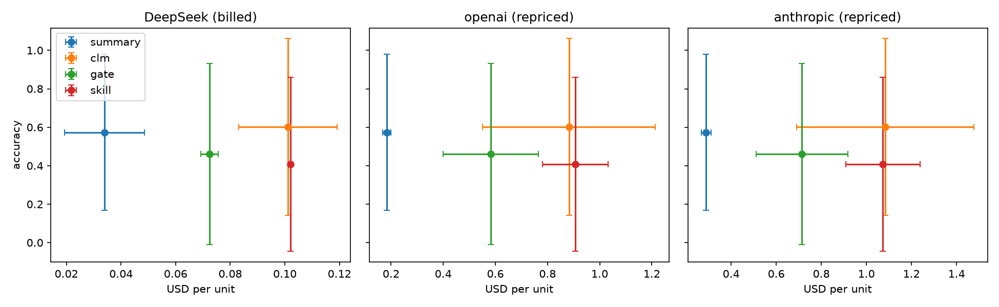

# CacheCLM results

2 units (one per distinct text), means over repeats. Unpaired runs (left out): none.
Diverged streams (costs summed): none.

## All units

Units: 2.

1. **Accuracy, CLM − summary:** +0.028 (95% CI -0.010 to +0.067; sign-flip p = 1.000)
2. **Billed $ on DeepSeek, clm / summary:** 3.11x (95% CI 1.98x to 4.88x; sign-flip p = 0.497)
3. **Billed $ on DeepSeek, gate / summary:** 2.24x (95% CI 1.57x to 3.20x; sign-flip p = 0.497)
4. **Share of CLM's accuracy gain the gate keeps:** -400% (95% CI -400% to 1600%)
5. **Billed $ on DeepSeek, skill / summary (exploratory):** 3.16x (95% CI 2.30x to 4.35x; sign-flip p = 0.497)
6. **Accuracy, skill − summary (exploratory):** -0.167 (95% CI -0.200 to -0.133; sign-flip p = 0.497)

| Arm | Accuracy | Billed $ | Edits | Rejected | Re-billed tokens | Forced truncations | Cut off | Cache hit (billed / ideal) |
|---|---|---|---|---|---|---|---|---|
| summary | 0.573 | 0.0340 | 0.0 | 0.0 | 0 | 0.0 | 3.0 | 61% / 83% |
| clm | 0.602 | 0.1011 | 4.0 | 0.0 | 21,278 | 3.5 | 2.5 | 56% / 78% |
| gate | 0.460 | 0.0724 | 9.0 | 3.5 | 10,672 | 2.0 | 1.0 | 60% / 86% |
| skill | 0.407 | 0.1020 | 11.0 | 0.0 | 20,830 | 1.0 | 2.5 | 38% / 74% |
| none | 0.322 | 0.0048 | 0.0 | 0.0 | 0 | 0.0 | 0.0 | 0% / 39% |
| full | 0.612 | 0.0246 | 0.0 | 0.0 | 0 | 0.0 | 0.0 | 85% / 95% |

## eventqa

Units: 1.

1. **Accuracy, CLM − summary:** +0.067 (95% CI +0.067 to +0.067; sign-flip p = 1.000)
2. **Billed $ on DeepSeek, clm / summary:** 4.88x (95% CI 4.88x to 4.88x; sign-flip p = 1.000)
3. **Billed $ on DeepSeek, gate / summary:** 3.20x (95% CI 3.20x to 3.20x; sign-flip p = 1.000)
4. **Share of CLM's accuracy gain the gate keeps:** -100% (95% CI -100% to -100%)
5. **Billed $ on DeepSeek, skill / summary (exploratory):** 4.35x (95% CI 4.35x to 4.35x; sign-flip p = 1.000)
6. **Accuracy, skill − summary (exploratory):** -0.133 (95% CI -0.133 to -0.133; sign-flip p = 1.000)

| Arm | Accuracy | Billed $ | Edits | Rejected | Re-billed tokens | Forced truncations | Cut off | Cache hit (billed / ideal) |
|---|---|---|---|---|---|---|---|---|
| summary | 0.867 | 0.0234 | 0.0 | 0.0 | 0 | 0.0 | 1.0 | 59% / 67% |
| clm | 0.933 | 0.1141 | 6.0 | 0.0 | 30,661 | 4.0 | 2.0 | 60% / 71% |
| gate | 0.800 | 0.0748 | 15.0 | 5.0 | 21,345 | 1.0 | 0.0 | 68% / 82% |
| skill | 0.733 | 0.1017 | 18.0 | 0.0 | 36,979 | 0.0 | 2.0 | 37% / 56% |
| none | 0.533 | 0.0020 | 0.0 | 0.0 | 0 | 0.0 | 0.0 | 0% / 17% |
| full | 0.933 | 0.0101 | 0.0 | 0.0 | 0 | 0.0 | 0.0 | 87% / 91% |

## factconsolidation

Units: 1.

1. **Accuracy, CLM − summary:** -0.010 (95% CI -0.010 to -0.010; sign-flip p = 1.000)
2. **Billed $ on DeepSeek, clm / summary:** 1.98x (95% CI 1.98x to 1.98x; sign-flip p = 1.000)
3. **Billed $ on DeepSeek, gate / summary:** 1.57x (95% CI 1.57x to 1.57x; sign-flip p = 1.000)
4. **Share of CLM's accuracy gain the gate keeps:** undefined (CLM gained under 1 point over summary)
5. **Billed $ on DeepSeek, skill / summary (exploratory):** 2.30x (95% CI 2.30x to 2.30x; sign-flip p = 1.000)
6. **Accuracy, skill − summary (exploratory):** -0.200 (95% CI -0.200 to -0.200; sign-flip p = 1.000)

| Arm | Accuracy | Billed $ | Edits | Rejected | Re-billed tokens | Forced truncations | Cut off | Cache hit (billed / ideal) |
|---|---|---|---|---|---|---|---|---|
| summary | 0.280 | 0.0446 | 0.0 | 0.0 | 0 | 0.0 | 5.0 | 62% / 89% |
| clm | 0.270 | 0.0882 | 2.0 | 0.0 | 11,895 | 3.0 | 3.0 | 52% / 85% |
| gate | 0.120 | 0.0701 | 3.0 | 2.0 | 0 | 3.0 | 2.0 | 53% / 89% |
| skill | 0.080 | 0.1024 | 4.0 | 0.0 | 4,681 | 2.0 | 3.0 | 39% / 85% |
| none | 0.110 | 0.0075 | 0.0 | 0.0 | 0 | 0.0 | 0.0 | 0% / 46% |
| full | 0.290 | 0.0391 | 0.0 | 0.0 | 0 | 0.0 | 0.0 | 85% / 96% |

## Repriced under three providers (ideal cache, USD per unit)

| Arm | deepseek | openai | anthropic |
|---|---|---|---|
| summary | 0.0198 | 0.1842 | 0.2891 |
| clm | 0.0827 | 0.8828 | 1.0831 |
| gate | 0.0533 | 0.5826 | 0.7142 |
| skill | 0.0835 | 0.9068 | 1.0734 |

## Fact errors: retention (gold fact lost) vs resolution (gold fact kept, wrong answer)

| Arm | Retention | Resolution |
|---|---|---|
| summary | 25 | 0 |
| clm | 30 | 2 |
| gate | 38 | 2 |
| skill | 43 | 1 |

## Per unit

| Unit | Family | Samples | summary acc | summary $ | clm acc | clm $ | gate acc | gate $ | skill acc | skill $ |
|---|---|---|---|---|---|---|---|---|---|---|
| 9e91dba7c4 | eventqa | Accurate_Retrieval/12[285000:349000]q47 | 0.87 | 0.0234 | 0.93 | 0.1141 | 0.80 | 0.0748 | 0.73 | 0.1017 |
| bfac27b756 | factconsolidation | Conflict_Resolution/0, Conflict_Resolution/4 | 0.28 | 0.0446 | 0.27 | 0.0882 | 0.12 | 0.0701 | 0.08 | 0.1024 |

## Gate decisions (examples)

- `python3 edit.py`: allowed (over the limit): breaks 20 cached tokens to free 492
- `python3 edit.py`: allowed (over the limit): breaks 0 cached tokens to free 0
- `python3 edit.py`: edit rejected: breaks 3,120 cached tokens to save 0; prefer deleting near the end
- `cat new.txt > ctx.txt`: edit rejected: breaks 3,066 cached tokens to save 17; prefer deleting near the end

